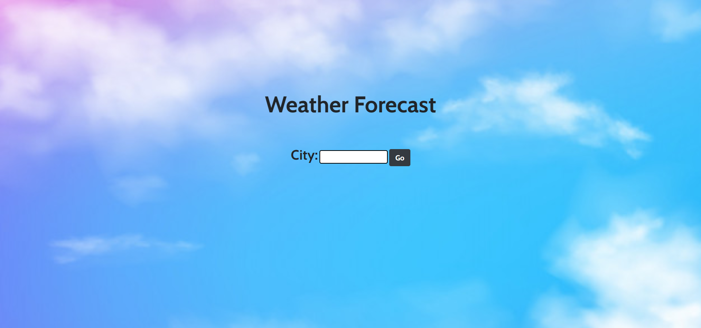

<h1>Weather Forecast🌨️</h1>

In this web application, you need to enter your city name and it will give you related weather details.⛈️

<h4>Languages Used</h4>
<ul>
    <li>HTML</li>
    <li>CSS</li>
    <li>Javascript - Node.js</li>
</ul>

<h4>Framework Used</h4>
<ul>
    <li>Bootstrap(Frontend)</li>
    <li>Express.js(Backend)</li>
</ul>

<h4>API Used</h4>
<li><a href="https://openweathermap.org">Openweathermap</a></li>

